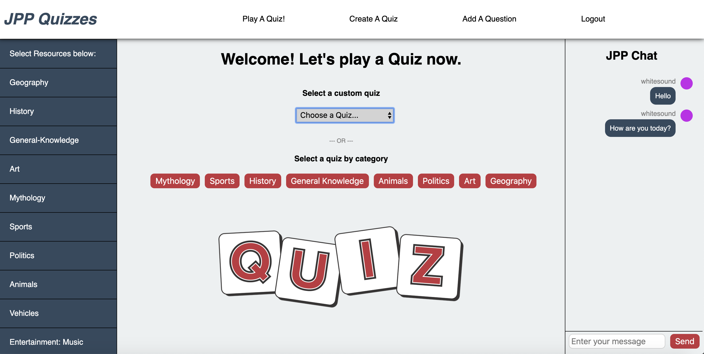

# Quiz App
## Week 15 Group Project @ CodeClan
### (April 8, 2020 - April 15, 2020)

The Quiz App allows you to play an already created quiz or play a randomly generated quiz with questions related to a selected category (mythology, entertainment, animals etc). Users can also create an entirely new quiz and define their own questions.

The project is built using:
* HTML / CSS
* JavaScript & Java
* JS React(front-end)
* Java Spring, H2 database (back-end)
* Additional libraries used: react-sidebar, react-to-print

## User interaction / journey
Start at http://localhost:3000/login

#### Login
First of all, create an account and click Log in. This allows for greater personalisation of the app content.

#### Play a Quiz!
The "Play a Quiz" tab is the main page where you can access and play quizzes. A user has got 2 options: The user can selecte an already created quiz from a list of Quizzes. ALternatively, the user can play a quiz including questions related to a selected topic (Mythology, Sports, History etc). As soon as a quiz is selected, the user is presented with a set of questions and possible answers. Once the user selects answers for all questions, the result page summarizes user's result. There is also an option to save the Quiz result in PDF.  

#### Create a Quiz
Users can also create their own custom quizzes and share them with their friends. In the "Create a Quiz" tab, the user types in a name for the quiz, and selects the desired number of questions that the quiz will contain. Each question then needs to be set up individually, specifying the question, possible answers, question type, category and difficulty.

#### Add a Question
In the "Add a Question" tab, the user is able to assign a new question to an already created quiz. Again, the question needs question type, category, difficulty, correct answer and a set of incorrect answers.

#### Left side bar - Resources
The side bar on the left hand side give the user an opportunity to improve their knowledge of a selected quiz category. Those are links to external websites. 

#### Right side bar - Chat
Users can also engage in a real-time chat to make it more fun!

## Project Brief (as given by CodeClan):
Build a Shares Portfolio Application. A local trader has come to you with a portfolio of shares. She wants to be able to analyse it more effectively. She has a small sample data set to give you and would like you to build a Minimum Viable Product that uses the data to display her portfolio so that she can make better decisions.

#### Minimum Viable Product requirements (MVP):
* Create an application that displays a user to play a quiz, containing a set of questions
* Allow these questions to be in different categories (Sport, General Knowledge, Music)
* Create a form that allows users to create their own quiz
* Calculate user's score based on the ratio of correct/incorrect answers

#### Example Extensions
* User would also be able to add a single question to our existing database, hence creating a community that actively contributes with questions to our question database)
* Improve section. Reading notes and links to websites on particular topics you want to brush up on.
* Exploring the potential to host multiple users from different locations.

## Set up / Running the project
##### Front-end (client)
* download Quiz_app_project
* in terminal, navigate to the Quiz_app_project
* cd client
* cd quizapp
* npm install
* npm start
* The application will run on http://localhost:3000/

##### Back-end (server):
* In IntelliJ, open the server folder and run the app.
* Back-end available at http://localhost:8080/api/h2/
